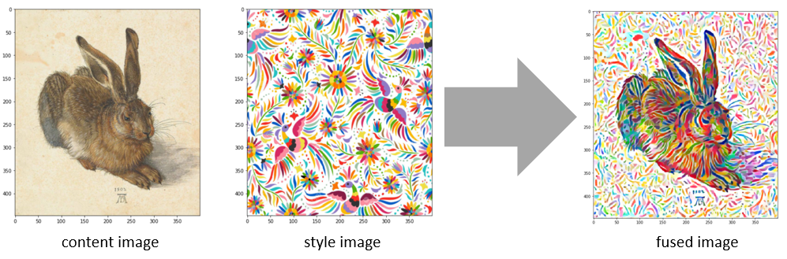
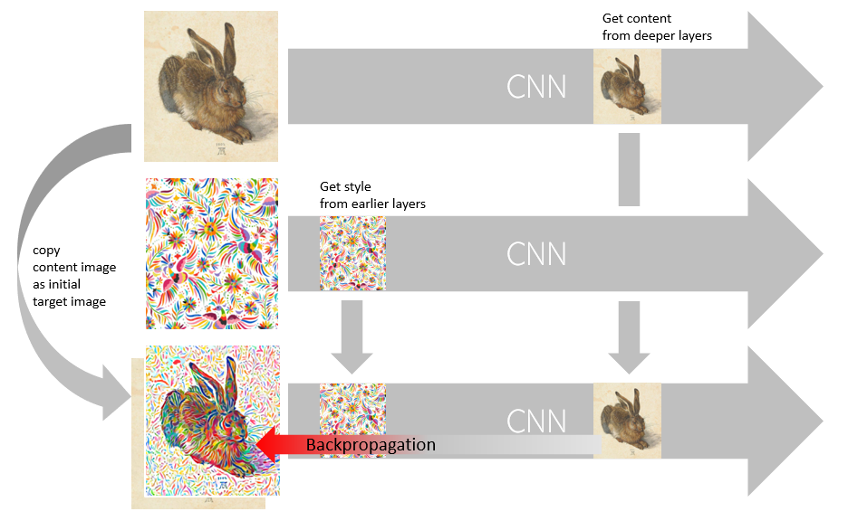
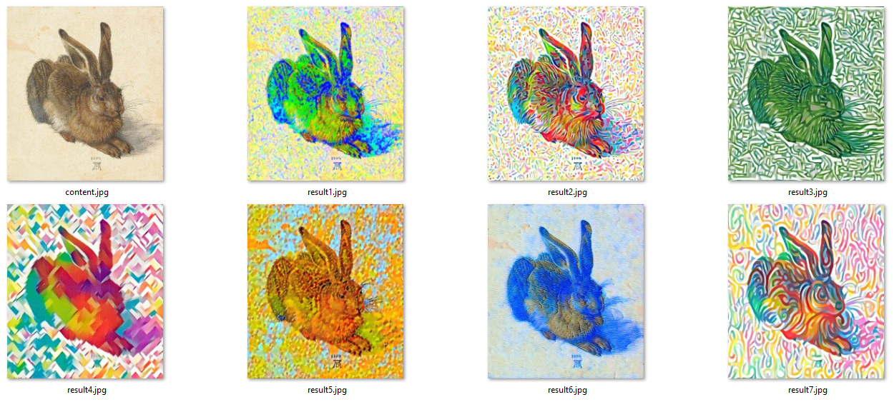

# Style Transfer with  a VGG-11 network
### Basic principles of style transfer
In this notebook we implement a style transfer method, which is originally described in the paper [Image Style Transfer Using Convolutional Neural Networks, by Gatys, Ecker and Bethge](https://www.cv-foundation.org/openaccess/content_cvpr_2016/papers/Gatys_Image_Style_Transfer_CVPR_2016_paper.pdf). Please  have a look into this document in order to get some initial understanding. 

Our target is to "transfer" the optical **style** of one image to another image by preserving the **content** of the original image. How to do that with a neural network? 

The basic idea is to feed a CNN (convolutional neural network) with images and to **extract** the style and content somehow. So the next question is, where the style and the content are to be found inside the network?

Let's first have a short look how the human brain (visual cortex, etc.) would process some optical information step by step: First of all (when some photons are recepted in the eye) the information would be very basic - e.g. "something red seen in the lower left corner". Then this information gets refined while flowing through the neurons: "something red seen, which has a round shape". Then - at some point - we would get the information: "a ball seen". If we look at this facts under the aspect of **style** and **content** we see something clearly: 

* **style** (color, texture, etc.) is more located in the earlier layers of the neural network (both human brains and artificial CNNs) - e.g. the usage of the color red 
* **content** is more located in the deeper layers of the neural network - e.g. recognizing special objects (persons, cars, etc. - or a ball in our case)

These insights are technically used for the **style transfer** via CNNs as follows:

* The **style image** is send through the CNN in order to get the style information out of the earlier layers
* The **content image** is send through the CNN in order to get the content information out of the deeper layers

Next question is: How to transfer the style into the target image? We will start off with the target image as being a copy of the content image and "**inject the style**" with backpropagation step by step. However - there is one difference as with "normal backpropagation" of neural networks: Normally the loss is computed based on the final output of the network and the weights are adjusted inside the network. With style transfer the situation is different:

* The **style loss** is computed at the **style layers** (early in the network)
* The **content loss** is computed at the **content layers** (deeper in the network)
* **Backpropagation** does not affect the weights inside the network, but the **target image** being the input of network. (In our case it is better to regard the target image as the **very first layer** of the network.)

Depending on the style image choosen there are quite different results. (The original image - an ancient painting from Albrecht Dürer done in 1502 - is shown in the upper left.)

### Network selection
In this notebook we are using the VGG-11 network for implementation (in contrast to the VGG-19 network, which was proposed in the original paper, [Image Style Transfer Using Convolutional Neural Networks, by Gatys](https://www.cv-foundation.org/openaccess/content_cvpr_2016/papers/Gatys_Image_Style_Transfer_CVPR_2016_paper.pdf) Feel free to use other (more complex but also slower) networks, if you are a little bit familiar with style transfer. When using other VGG networks there should only be minor changes.

### Technical Preconditions
There are the following basic preconditions for running this notebook:
* Pytorch has to be installed (see https://pytorch.org/  for the installation notes)
* The usage of a GPU is highly recommened. (For small images also a CPU "might do it")   
